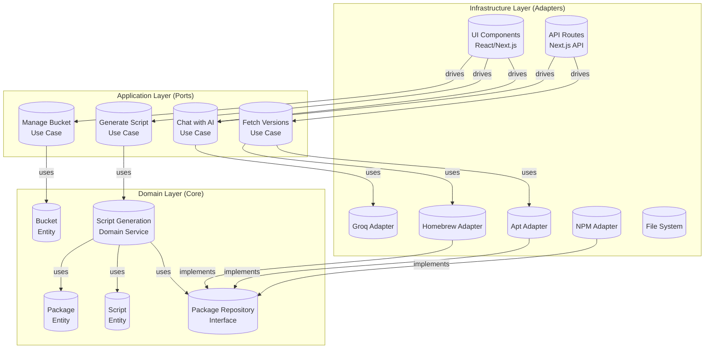

# Hexagonal Architecture Overview

SudoStart is organized around ports and adapters so core behavior can be tested without React, Next.js, Groq, browser storage, or registry HTTP calls.

## Layers

### Domain

`src/domain` contains the core model:

- Entities: `PackageEntity`, `Script`, `Bucket`
- Value objects: `Platform`, `Shell`, `Version`
- Repository interfaces: `PackageRepository`, `VersionRepository`
- Domain services: script generation and install cost estimation

Domain code should not import React components, API routes, Zustand stores, SDK clients, or browser APIs.

### Application

`src/application` contains use cases and ports:

- `GenerateScriptUseCase`
- `ChatWithAIUseCase`
- `FetchVersionsUseCase`
- `ManageBucketUseCase`
- `ParseAIActionUseCase`
- `ShareScriptUseCase`

Use cases coordinate domain objects and outgoing ports. They should not know whether the caller is a React component, API route, CLI command, or test.

### Infrastructure

`src/infrastructure` contains adapters:

- AI: Groq and future OpenAI adapter
- Catalog: static package repository
- Registries: HTTP and browser version repositories
- Storage: local storage adapter
- Sharing: file-backed script share adapter
- Config: server and browser-safe dependency containers

External dependencies belong here.

### Presentation

`src/presentation` contains UI implementations. `src/components` exposes thin compatibility wrappers so existing imports remain stable while presentation code moves out of the legacy component layer.

Presentation code can call browser-safe use cases through `clientContainer`, but it should not import static catalog data or server adapters directly.

## Dependency Direction

Allowed direction:

`presentation/api -> application -> domain`

Adapters implement ports and are injected from infrastructure containers. Domain and application code do not import infrastructure implementations.

## Adding a Provider or Registry

To add a new AI provider, implement `AIProvider` and wire it in the DI container.

To add a new version source, implement `VersionRepository` or extend the HTTP version repository source map.

To add a new package catalog backend, implement `PackageRepository` and replace the static package repository binding.
